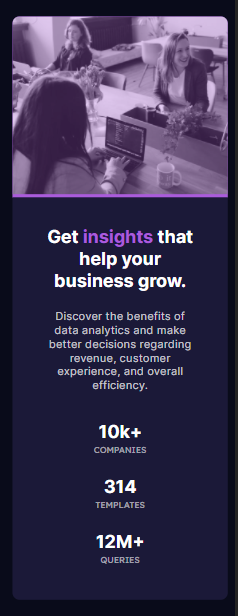

# stats-preview-card-component-main

Componente de cartão de visualização de estatísticas :chart_with_upwards_trend:

Desafio proposto pela plataforma <a href="https://www.frontendmentor.io/">[Frontend Mentor]</a>
  
  <i>O desafio é construir um componente do cartão de visualização de estatística e fazê-lo o mais parecido com o design proposto</i> :hammer:
  
  Disponilizado pela plataforma:
  * Arquivos de imagens
  * Guia de estilos (fonte, opções de cores, tamanho da View (web e mobile)
 
Tecnologias usadas:

* HTML
* CSS

## Preview page Web
</img> 
## Preview page Mobile
</img>
